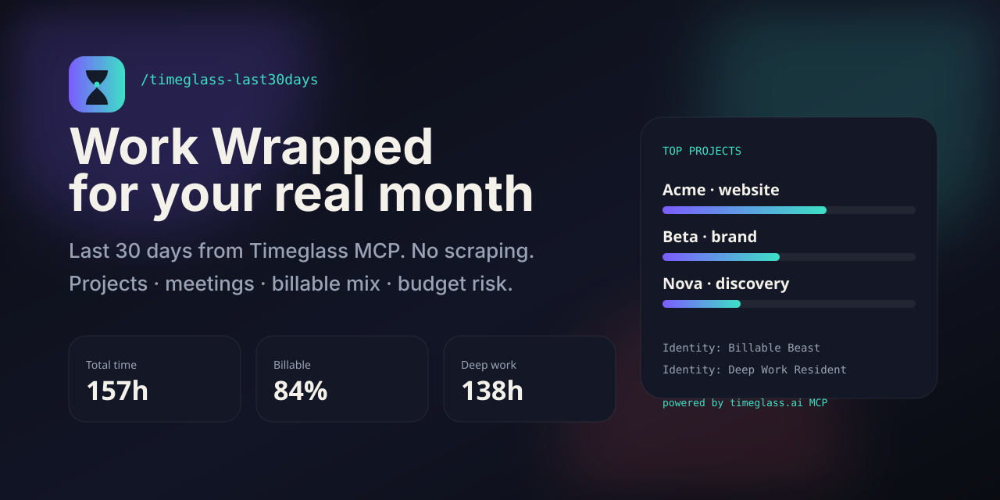

# /timeglass-last30days

<p align="center">
  
</p>

<p align="center">
  <a href="https://github.com/rdsciv/timeglass-last30days/stargazers"></a>
  <a href="LICENSE"></a>
  <a href="https://timeglass.ai"></a>
  <a href="https://agentskills.io"></a>
</p>

**Spotify Wrapped, but for your actual work.**

`/last30days` told you what the internet said about a topic.  
**`/timeglass-last30days` tells you what *you* did** — from the [Timeglass](https://timeglass.ai) work record over MCP.

No timers to reconstruct. No CSV exports. No scraping Reddit.  
Your agent pulls the last 30 days from Timeglass and hands you a **Work Wrapped**.

```text
⏳ timeglass-last30days v1.0.0 · 2026-06-29 → 2026-07-28

Your last 30 days: 157.2h tracked, led by Acme Corp · website redesign, 12% meetings.

Total   157h   active days 22
Billable  84.0%   meetings 12.0%   deep 138h

Top projects:
  █████████░░░░░░░░░░░░░░░   38.2%   60.0h  Acme Corp · website redesign
  ██████░░░░░░░░░░░░░░░░░░   27.1%   42.6h  Beta Studio · brand refresh
  …
```

---

## Why this exists

Timeglass already captures the work as it happens and connects to Claude / ChatGPT over MCP. What’s missing is the **shareable, addictive monthly ritual** — the thing people run on the 1st, screenshot, and send to their team.

`last30days-skill` went viral because it turned messy multi-source research into one command.  
This repo does the same for **your month of work**, with a much simpler stack:

| | last30days-skill | timeglass-last30days |
|---|---|---|
| Question | What did people say? | What did **I** do? |
| Data | Reddit, X, YouTube, … | Timeglass MCP only |
| Hard part | Scrapers + keys + anti-bot | Auth + synthesis |
| Output | Research brief | **Work Wrapped** |

If you bill time, manage a studio, or just want an honest look at where the month went — this is the skill.

---

## Install

**Claude Code**

```text
/plugin marketplace add rdsciv/timeglass-last30days
/plugin install timeglass-last30days
```

**Codex · Cursor · Copilot · Gemini CLI · 50+ [Agent Skills](https://agentskills.io) hosts**

```bash
npx skills add rdsciv/timeglass-last30days -g
```

**Manual**

```bash
git clone https://github.com/rdsciv/timeglass-last30days.git
# Point your agent at skills/timeglass-last30days/SKILL.md
```

**Hermes**

```bash
# clone or add skill path, then:
python3 skills/timeglass-last30days/scripts/last30work.py --demo
```

---

## Quick start (30 seconds, no account)

```bash
git clone https://github.com/rdsciv/timeglass-last30days.git
cd timeglass-last30days
python3 skills/timeglass-last30days/scripts/last30work.py --demo --emit all --out ./out
open out/work-wrapped.html   # macOS
```

That uses the bundled fixture so the README path always works. Open the HTML — that’s the product.

---

## Live Timeglass (the real thing)

1. Use Timeglass daily ([timeglass.ai](https://timeglass.ai)) so the work record exists.
2. Connect an assistant over MCP: [Connect Claude or ChatGPT](https://timeglass.ai/help/ai-assistant/connect-ai-assistant)  
   or sign in via the Raycast Timeglass extension (OAuth scope includes `mcp:read`).
3. Export a token your host can see as `TIMEGASS_MCP_TOKEN`, **or** run inside a host that already has the Timeglass MCP tools attached.
4. Run:

```bash
export TIMEGASS_MCP_TOKEN='…'   # never commit
python3 skills/timeglass-last30days/scripts/last30work.py --days 30 --emit all --out ~/Documents/TimeglassWrapped
```

### Auth law (read once)

| Credential | Works for |
|---|---|
| AI connector / Raycast OAuth (`mcp:read`) | ✅ Product MCP `https://app.timeglass.ai/api/mcp` |
| Desktop app upload token in `config.json` | ❌ Wrong audience — expect `invalid_token` |

Desktop tokens upload captures. They are **not** MCP tokens. `--doctor` will tell you which world you’re in.

```bash
python3 skills/timeglass-last30days/scripts/last30work.py --doctor
```

---

## What you get

### Numbers that matter
- Total hours · active days · avg / active day  
- Billable mix · meeting load · deep work  
- Top projects, clients, activities, apps  
- Weekday rhythm · busiest day · budget NEAR/OVER  

### Identity cards
Playful labels grounded in math — “Meeting Main Character”, “Billable Beast”, “Acme Whisperer” — not empty flattery.

### Artifacts
| File | What |
|---|---|
| `work-wrapped.md` | Agent-ready brief |
| `work-wrapped.json` | Full stats payload |
| `work-wrapped.html` | Self-contained visual Wrapped |

### Follow-ups your agent can do next
- “Draft a status update for Acme from this month”  
- “What should I protect next week?”  
- “Zoom into Beta Studio only”  

---

## How it works

```text
Timeglass capture (as you work)
        │
        ▼
Timeglass MCP  ── query_work_records / directory / set_team
        │
        ▼
last30work.py  ── normalize → stats → markdown + HTML
        │
        ▼
Your agent synthesizes Work Wrapped (SKILL.md contract)
```

MCP tools used:

- `query_workspace_directory` — resolve real **team_id** (from `team_tree`, never `workspace_id`)
- `set_team`
- `query_work_records` — `projects`, `project_daily_summary`, `user_daily_summary`, `activities`, `meetings`

Optional later: `get_meeting_transcript`, `get_minute_screenshots`.

---

## Agent skill contract

Runtime source of truth: [`skills/timeglass-last30days/SKILL.md`](skills/timeglass-last30days/SKILL.md)

Ask your agent:

```text
/timeglass-last30days
Work Wrapped for my last 30 days
```

or:

```text
Build my Work Wrapped from Timeglass. Use the skill. Prefer live MCP; fall back to --demo only if I say so.
```

---

## Project layout

```text
.
├── README.md
├── skills/timeglass-last30days/
│   ├── SKILL.md                 # agent contract
│   ├── scripts/last30work.py    # engine CLI
│   ├── scripts/lib/             # mcp · parse · stats · render
│   ├── fixtures/sample_month.json
│   ├── templates/
│   └── agents/openai.yaml
├── docs/MCP.md
├── tests/
├── media/hero.svg
└── .claude-plugin/ · .codex-plugin/ · .grok-plugin/
```

---

## Comparison

**last30days** answers: *what is true in the world right now?*  
**timeglass-last30days** answers: *what is true about my work this month?*

You probably want both.

---

## Security & privacy

- MIT license. No analytics in the engine.  
- Tokens stay in env vars / your host’s secret store — never written into reports.  
- MCP only returns what your Timeglass role can already see.  
- Demo fixture is synthetic (Rivera Studio) — not real customer data.

---

## Development

```bash
python3 -m unittest discover -s tests -v
python3 skills/timeglass-last30days/scripts/last30work.py --preflight
```

Python 3.10+ · stdlib only (no pip install required for the engine).

---

## Star History

[](https://star-history.com/#rdsciv/timeglass-last30days&Date)

---

<p align="center">
  <strong>Your timesheet already knows.</strong><br />
  Now your agent can wrap it.<br /><br />
  <a href="https://timeglass.ai">timeglass.ai</a> ·
  <a href="https://github.com/rdsciv/timeglass-last30days">github.com/rdsciv/timeglass-last30days</a>
</p>
